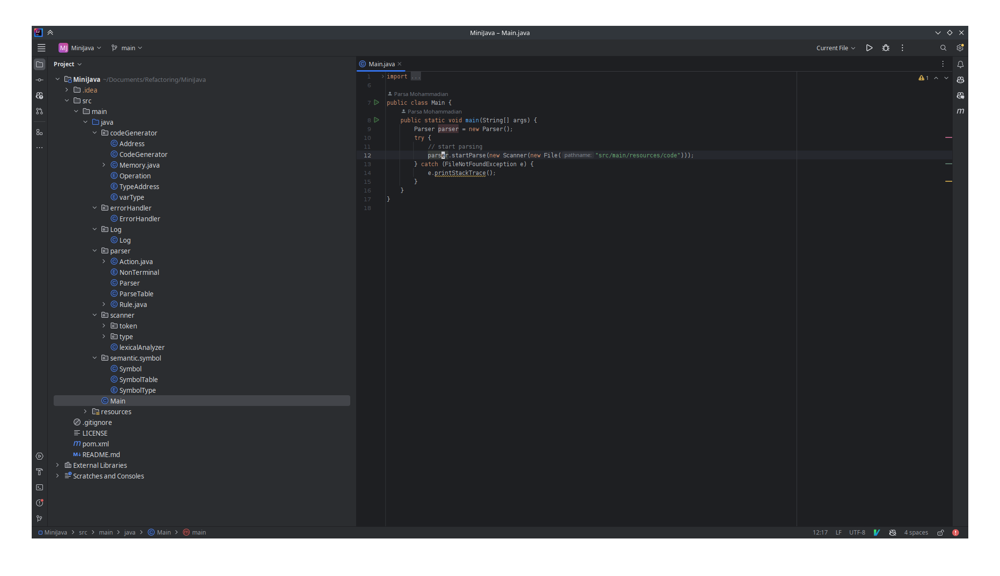
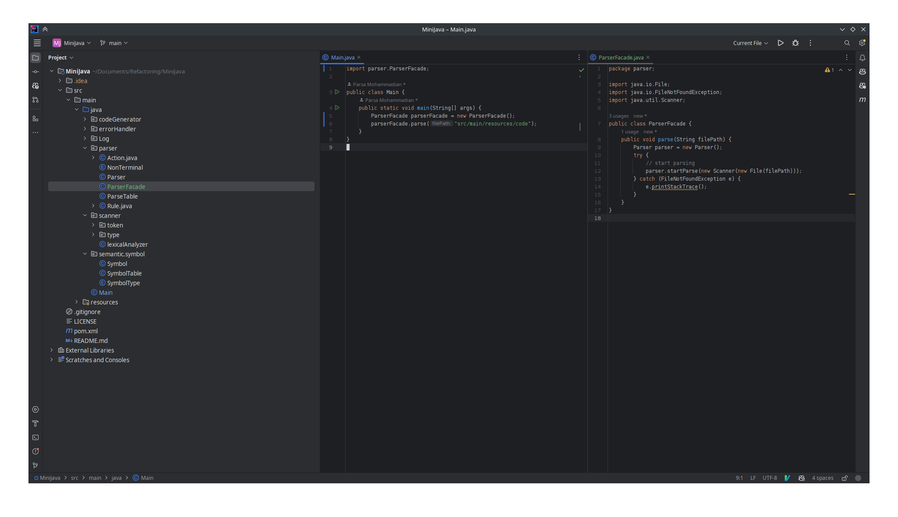
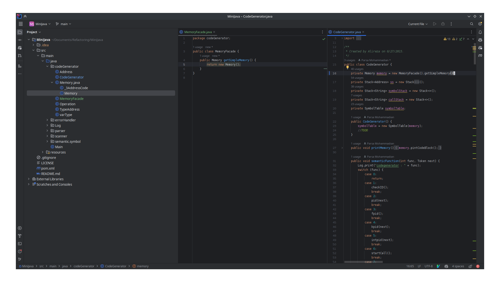
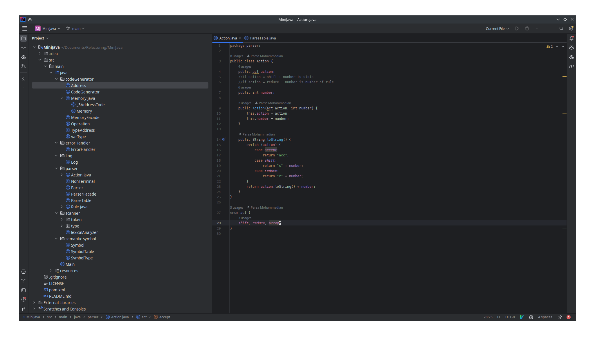
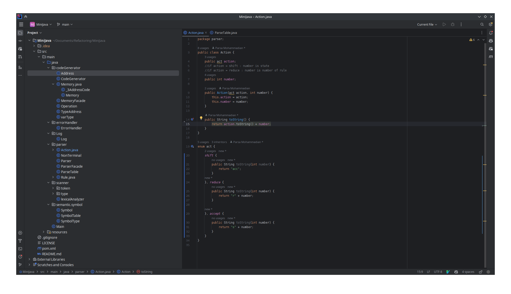
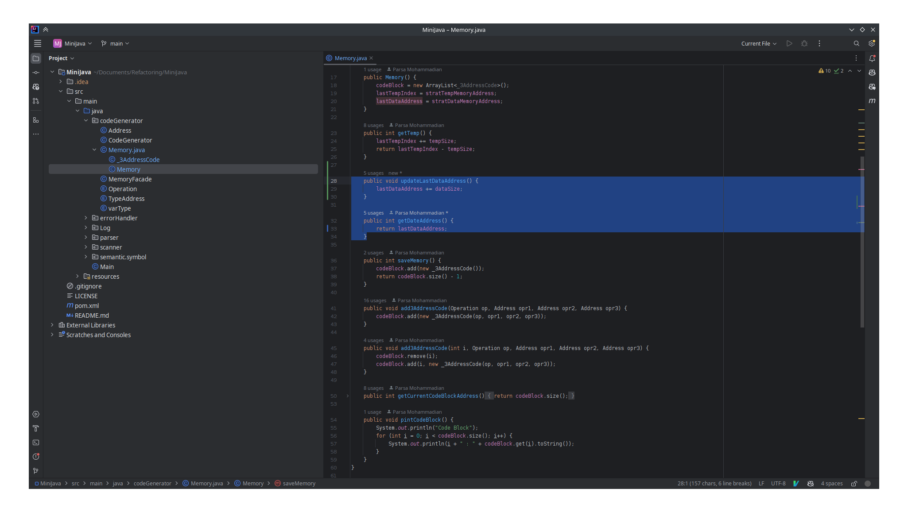
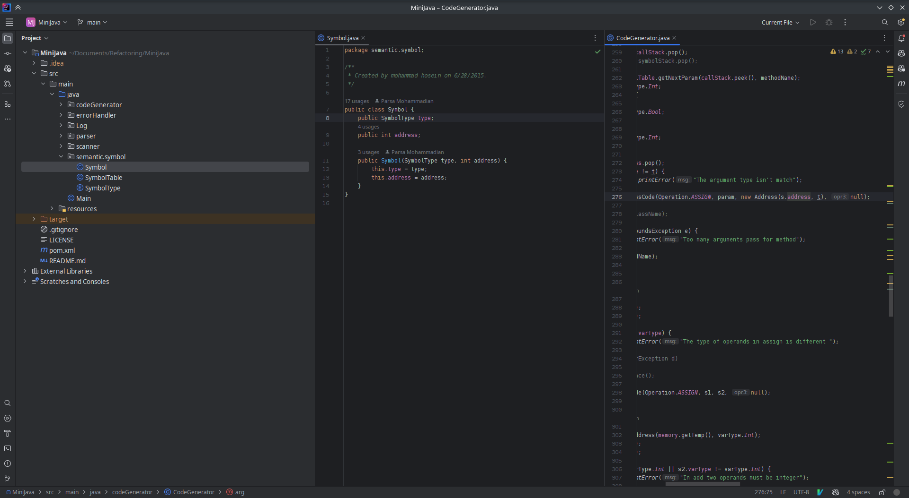
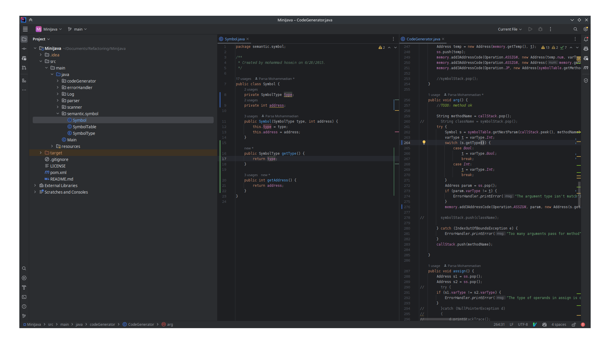
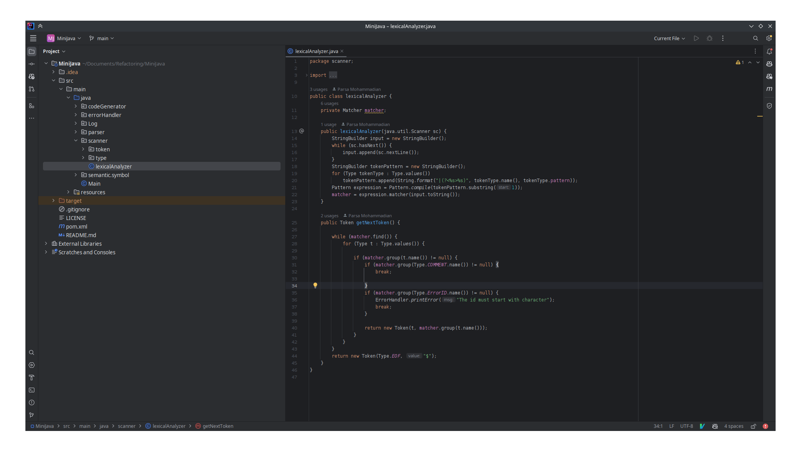
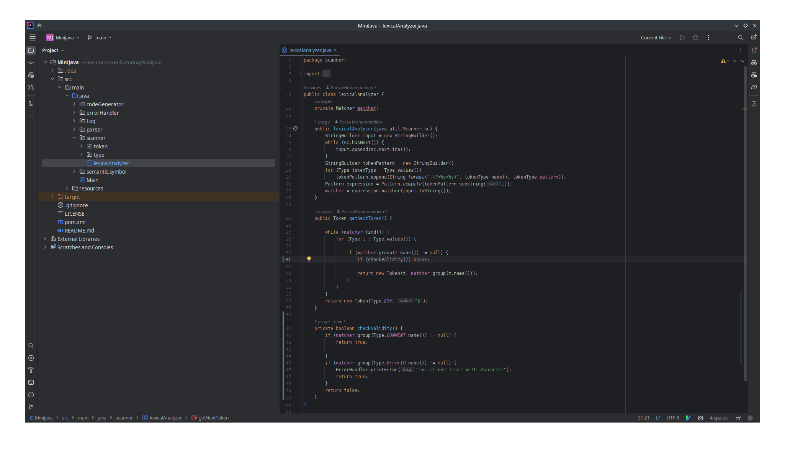

# Refactoring

## روال انجام آزمایش
1. الگوی Facade
   1. در کلاس main مشاهده می‌کنیم برای اجرای پارسر تنظیماتی مانند خواندن فایل انجام شده است. این تنظیمات را به کلاس دیگری منتقل کردیم.
   
   
   2. از آنجایی که مموری می‌توان انواع مختلفی داشته باشد، خوب است مموری را با استفاده از فساد استفاده کنیم.
   
2. یک مورد State/Strategy یا استفاده از Polymorphism به جای شرط: در کلاس Action این مورد در enum act انجام شد.
   
   
3. یک مورد Separate Query From Modifier
   در کلاس Memory این مشکل رخ داده بود که توابع مربوط به آن جدا شد.
   
4. تبدیل فیلدهای پابلیک کلاس Symbol به فیلدهای پرایوت به همراه getter. این کار اجاره تغییر غیر ضروری این مقادیر را نمی‌دهد و کد را در مقابل باگ‌ها تقویت می‌کند. 
    
    
5. استخراج تابع: در کلاس lexicalAnalyzer و تابع getNextToken چندین شرط تو در تو وجود داشت که خوانایی کد را پائین میاورد. با استخراج متد از این قسمت خوانایی بهتر شده است. 
    
    

## پرسش‌ها

1. توضیح موارد:
   1. کد تمیز به کدی اطلاق می‌شود که خواندن و درک آن برای سایر برنامه‌نویس‌های یک زبان راحت باشد. کد تمیز از اصول هر زبان پیروی می‌کند و قابلیت توسعه‌پذیری بالایی دارد.
   2. بدهی فنی به معنی انجام یک کار غلط یا غیر اصولی در گذشته است که توسعه کد را در زمان حال با مشکل مواجه می‌کند.
   3. بوی بد نشانه‌هایی در کد هستند که نشان‌دهنده تمیز نبودن کد می‌باشند. برنامه‌نویس باید سعی کند بوهای بد کدش را به حداقل برساند.
2. توضیح موارد:
   1. بلوترز: این موارد توابع یا کلاس‌های بزرگی هستند که کارهای زیادی انجام می‌دهند. معمولا این مورد از انباشت کدها در طولانی مدت بوجود می‌آید.
   2. سو استفاده کنندگان شی گرایی: این موارد از اصول طراحی شی گرا به غلط استفاده می‌کنند.
   3. جلوگیری کنندگان از تغییر: این موارد باعث می‌شوند که اگر بخواهیم بخشی از کد را تغییر دهیم مجبور شویم بخش‌های دیگر هم تغییر دهیم. به طور کلی توسعه کد را مشکل می‌کنند.
   4. غیر قابل مصرف‌ها: این‌ها مواردی هستند که حذف آن‌ها از کد مشکلی بوجود نخواهد آورد و وجودشان ضرورتی ندارد.
   5. جفت‌کنندگان: به وابسته‌سازی بیش از حد اجزای برنامه به یکدیگر اطلاق می‌شود. این موارد تغییر در برنامه را سخت خواهند کرد. 
3.  کلاس تنبل به کلاس‌هایی گفته می‌شود که به ندرت استفاده می‌شوند. این بوی بد به دسته ۴ تعلق دارد. برای برطرف کردن این بوی بد میتوان از کلاس‌های درون‌خطی استفاده کرد. زمانی باید این کلاس را نادیده گرفت که مسئولیت این کلاس قرار باشد در آینده زیاد مورد تغییر واقع شود. یا اینکه وجود این کلاس باعث کمک فاحش به خوانایی کد شود و پاک کردن آن به خوانایی کد ضربه بزند. 

